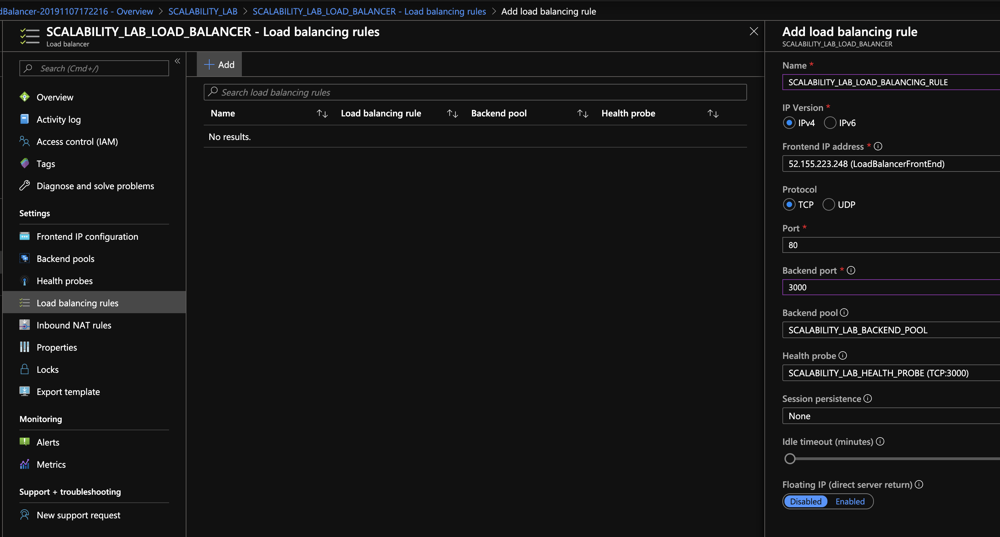

### Escuela Colombiana de Ingeniería
### Arquitecturas de Software - ARSW

### Juan Pablo Daza Pinzon - Juan Sebastian Rodriguez Peña

## Escalamiento en Azure con Maquinas Virtuales, Sacale Sets y Service Plans

### Dependencias
* Cree una cuenta gratuita dentro de Azure. Para hacerlo puede guiarse de esta [documentación](https://azure.microsoft.com/es-es/free/students/). Al hacerlo usted contará con $100 USD para gastar durante 12 meses.

### Parte 0 - Entendiendo el escenario de calidad

Adjunto a este laboratorio usted podrá encontrar una aplicación totalmente desarrollada que tiene como objetivo calcular el enésimo valor de la secuencia de Fibonnaci.

**Escalabilidad**
Cuando un conjunto de usuarios consulta un enésimo número (superior a 1000000) de la secuencia de Fibonacci de forma concurrente y el sistema se encuentra bajo condiciones normales de operación, todas las peticiones deben ser respondidas y el consumo de CPU del sistema no puede superar el 70%.

### Parte 1 - Escalabilidad vertical

1. Diríjase a el [Portal de Azure](https://portal.azure.com/) y a continuación cree una maquina virtual con las características básicas descritas en la imágen 1 y que corresponden a las siguientes:
    * Resource Group = SCALABILITY_LAB
    * Virtual machine name = VERTICAL-SCALABILITY
    * Image = Ubuntu Server 
    * Size = Standard B1ls
    * Username = scalability_lab
    * SSH publi key = Su llave ssh publica


2. Para conectarse a la VM use el siguiente comando, donde las `x` las debe remplazar por la IP de su propia VM (Revise la sección "Connect" de la virtual machine creada para tener una guía más detallada).

    `ssh scalability_lab@xxx.xxx.xxx.xxx`

3. Instale node, para ello siga la sección *Installing Node.js and npm using NVM* que encontrará en este [enlace](https://linuxize.com/post/how-to-install-node-js-on-ubuntu-18.04/).
4. Para instalar la aplicación adjunta al Laboratorio, suba la carpeta `FibonacciApp` a un repositorio al cual tenga acceso y ejecute estos comandos dentro de la VM:

    `git clone <your_repo>`

    `cd <your_repo>/FibonacciApp`

    `npm install`

5. Para ejecutar la aplicación puede usar el comando `npm FibinacciApp.js`, sin embargo una vez pierda la conexión ssh la aplicación dejará de funcionar. Para evitar ese compartamiento usaremos *forever*. Ejecute los siguientes comando dentro de la VM.

    ` node FibonacciApp.js`

6. Antes de verificar si el endpoint funciona, en Azure vaya a la sección de *Networking* y cree una *Inbound port rule* tal como se muestra en la imágen. Para verificar que la aplicación funciona, use un browser y user el endpoint `http://xxx.xxx.xxx.xxx:3000/fibonacci/6`. La respuesta debe ser `The answer is 8`.


7. La función que calcula en enésimo número de la secuencia de Fibonacci está muy mal construido y consume bastante CPU para obtener la respuesta. Usando la consola del Browser documente los tiempos de respuesta para dicho endpoint usando los siguintes valores:
    * 1000000
    * 1010000
    * 1020000
    * 1030000
    * 1040000
    * 1050000
    * 1060000
    * 1070000
    * 1080000
    * 1090000    

8. Dírijase ahora a Azure y verifique el consumo de CPU para la VM. (Los resultados pueden tardar 5 minutos en aparecer).


9. Ahora usaremos Postman para simular una carga concurrente a nuestro sistema. Siga estos pasos.
    * Instale newman con el comando `npm install newman -g`. Para conocer más de Newman consulte el siguiente [enlace](https://learning.getpostman.com/docs/postman/collection-runs/command-line-integration-with-newman/).
    * Diríjase hasta la ruta `FibonacciApp/postman` en una maquina diferente a la VM.
    * Para el archivo `[ARSW_LOAD-BALANCING_AZURE].postman_environment.json` cambie el valor del parámetro `VM1` para que coincida con la IP de su VM.
    * Ejecute el siguiente comando.

    ```
    newman run ARSW_LOAD-BALANCING_AZURE.postman_collection.json -e [ARSW_LOAD-BALANCING_AZURE].postman_environment.json -n 10 &
    newman run ARSW_LOAD-BALANCING_AZURE.postman_collection.json -e [ARSW_LOAD-BALANCING_AZURE].postman_environment.json -n 10
    ```

10. La cantidad de CPU consumida es bastante grande y un conjunto considerable de peticiones concurrentes pueden hacer fallar nuestro servicio. Para solucionarlo usaremos una estrategia de Escalamiento Vertical. En Azure diríjase a la sección *size* y a continuación seleccione el tamaño `B2ms`.


11. Una vez el cambio se vea reflejado, repita el paso 7, 8 y 9.
12. Evalue el escenario de calidad asociado al requerimiento no funcional de escalabilidad y concluya si usando este modelo de escalabilidad logramos cumplirlo.
13. Vuelva a dejar la VM en el tamaño inicial para evitar cobros adicionales.

**Preguntas**

1. ¿Cuántos y cuáles recursos crea Azure junto con la VM?<br>

<br>

Crea la maquina virtual, la direccion ip asignada a la maquina, el grupo de seguridad de la maquina, la vlan a la que pertenece, la interfaz de red, el disco de la maquina y la llave publica para el acceso.

2. ¿Brevemente describa para qué sirve cada recurso?

La direccion ip asignada es la direccion ip publica que le asigna azure a nuestra maquina virtual.

El grupo de seguridad es donde se configuran todas la opciones de conexion y protocolos que puede usar la maquina virtual.

La vlan es una configuración de azure que da a cada maquina para poder establecer servicios en la misma red virtual.

La interfaz de red es la interfaz fisica de la maquina en donde esta alojada la maquina virtual.

El disco es donde esta alojada la maquina virtual y almacenamiento.

La llave publica es lo que usamos para conectarnos a travez de ssh y que la maquina confie en nosotros.

3. ¿Al cerrar la conexión ssh con la VM, por qué se cae la aplicación que ejecutamos con el comando `npm FibonacciApp.js`? ¿Por qué debemos crear un *Inbound port rule* antes de acceder al servicio?<br>

La aplicación se cae ya que es necesario cerrar la conexión SSH para detener la ejecución. Debemos crear un inbound port rule antes de acceder al servicio ya que antes de esto el puerto se encuentra cerrado y no se permite realizar una consulta.

4. Adjunte tabla de tiempos e interprete por qué la función tarda tando tiempo.

<br>

La funcion no es concurrente asi que tiene que calcular los numeros una y otra vez y no almacena resultados de números que ya calculo, por lo tanto, se demora en calcular los mismos numeros una y otra vez.

5. Adjunte imágen del consumo de CPU de la VM e interprete por qué la función consume esa cantidad de CPU.

B1ls:<br>

<br>

B2ms:<br>

<br>

La funcion no es concurrente, asi que tiene que calcular los numeros una y otra vez para poder dar la respuesta, por lo tanto, el procesador debe realizar muchos calculos innecesarios.


6. Adjunte la imagen del resumen de la ejecución de Postman. Interprete:
    * Tiempos de ejecución de cada petición.
    * Si hubo fallos documentelos y explique.

<br>
<br>

Los fallos que podemos ver, se generaron porque la aplicacion tarda mucho en responder, y mientras esta calculando un numero no puede calcular otro y por lo tanto no se calcula el segundo numero que se solicita.

7. ¿Cuál es la diferencia entre los tamaños `B2ms` y `B1ls` (no solo busque especificaciones de infraestructura)?<br>

La diferencia es que el tamaño B2ms puede ser cargado sobre diversos sistemas operativos, pero el tamaño B1ls solo puede ser cargado sobre el sistema operativo Linux.

8. ¿Aumentar el tamaño de la VM es una buena solución en este escenario?, ¿Qué pasa con la FibonacciApp cuando cambiamos el tamaño de la VM?

No es una buena solución ya que no hay un gran cambio en el tiempo de ejecución y sigue tardando mucho en dar respuesta.

9. ¿Qué pasa con la infraestructura cuando cambia el tamaño de la VM? ¿Qué efectos negativos implica?

Cambiando el tamaño vemos un incremento en el costo y aumenta la demora de ejecucion de la maquina.

10. ¿Hubo mejora en el consumo de CPU o en los tiempos de respuesta? Si/No ¿Por qué?

Si hubo mejora en el consumo y en los tiempos de respuesta pero no son suficientes como para justificar un mayor costo.

11. Aumente la cantidad de ejecuciones paralelas del comando de postman a `4`. ¿El comportamiento del sistema es porcentualmente mejor?

Si es mucho mejor que el anterior debido a que hay mas capacidad de procesamiento.

### Parte 2 - Escalabilidad horizontal

#### Crear el Balanceador de Carga

Antes de continuar puede eliminar el grupo de recursos anterior para evitar gastos adicionales y realizar la actividad en un grupo de recursos totalmente limpio.

1. El Balanceador de Carga es un recurso fundamental para habilitar la escalabilidad horizontal de nuestro sistema, por eso en este paso cree un balanceador de carga dentro de Azure tal cual como se muestra en la imágen adjunta.


2. A continuación cree un *Backend Pool*, guiese con la siguiente imágen.


3. A continuación cree un *Health Probe*, guiese con la siguiente imágen.


4. A continuación cree un *Load Balancing Rule*, guiese con la siguiente imágen.



5. Cree una *Virtual Network* dentro del grupo de recursos, guiese con la siguiente imágen.


#### Crear las maquinas virtuales (Nodos)

Ahora vamos a crear 3 VMs (VM1, VM2 y VM3) con direcciones IP públicas standar en 3 diferentes zonas de disponibilidad. Después las agregaremos al balanceador de carga.

1. En la configuración básica de la VM guíese por la siguiente imágen. Es importante que se fije en la "Avaiability Zone", donde la VM1 será 1, la VM2 será 2 y la VM3 será 3.


2. En la configuración de networking, verifique que se ha seleccionado la *Virtual Network*  y la *Subnet* creadas anteriormente. Adicionalmente asigne una IP pública y no olvide habilitar la redundancia de zona.


3. Para el Network Security Group seleccione "avanzado" y realice la siguiente configuración. No olvide crear un *Inbound Rule*, en el cual habilite el tráfico por el puerto 3000. Cuando cree la VM2 y la VM3, no necesita volver a crear el *Network Security Group*, sino que puede seleccionar el anteriormente creado.


4. Ahora asignaremos esta VM a nuestro balanceador de carga, para ello siga la configuración de la siguiente imágen.


5. Finalmente debemos instalar la aplicación de Fibonacci en la VM. para ello puede ejecutar el conjunto de los siguientes comandos, cambiando el nombre de la VM por el correcto

```
git clone https://github.com/daprieto1/ARSW_LOAD-BALANCING_AZURE.git

curl -o- https://raw.githubusercontent.com/creationix/nvm/v0.34.0/install.sh | bash
source /home/vm1/.bashrc
nvm install node

cd ARSW_LOAD-BALANCING_AZURE/FibonacciApp
npm install

npm install forever -g
forever start FibonacciApp.js
```

Realice este proceso para las 3 VMs, por ahora lo haremos a mano una por una, sin embargo es importante que usted sepa que existen herramientas para aumatizar este proceso, entre ellas encontramos Azure Resource Manager, OsDisk Images, Terraform con Vagrant y Paker, Puppet, Ansible entre otras.

#### Probar el resultado final de nuestra infraestructura

1. Porsupuesto el endpoint de acceso a nuestro sistema será la IP pública del balanceador de carga, primero verifiquemos que los servicios básicos están funcionando, consuma los siguientes recursos:

```
http://52.155.223.248/
http://52.155.223.248/fibonacci/1
```

2. Realice las pruebas de carga con `newman` que se realizaron en la parte 1 y haga un informe comparativo donde contraste: tiempos de respuesta, cantidad de peticiones respondidas con éxito, costos de las 2 infraestrucruras, es decir, la que desarrollamos con balanceo de carga horizontal y la que se hizo con una maquina virtual escalada.

3. Agregue una 4 maquina virtual y realice las pruebas de newman, pero esta vez no lance 2 peticiones en paralelo, sino que incrementelo a 4. Haga un informe donde presente el comportamiento de la CPU de las 4 VM y explique porque la tasa de éxito de las peticiones aumento con este estilo de escalabilidad.

```
newman run ARSW_LOAD-BALANCING_AZURE.postman_collection.json -e [ARSW_LOAD-BALANCING_AZURE].postman_environment.json -n 10 &
newman run ARSW_LOAD-BALANCING_AZURE.postman_collection.json -e [ARSW_LOAD-BALANCING_AZURE].postman_environment.json -n 10 &
newman run ARSW_LOAD-BALANCING_AZURE.postman_collection.json -e [ARSW_LOAD-BALANCING_AZURE].postman_environment.json -n 10 &
newman run ARSW_LOAD-BALANCING_AZURE.postman_collection.json -e [ARSW_LOAD-BALANCING_AZURE].postman_environment.json -n 10
```

**Preguntas**

* ¿Cuáles son los tipos de balanceadores de carga en Azure y en qué se diferencian?, ¿Qué es SKU, qué tipos hay y en qué se diferencian?, ¿Por qué el balanceador de carga necesita una IP pública?

#### Balanceador de Carga de Aplicación (ALB - Application Load Balancer):<br>
Este tipo de balanceador de carga opera en la capa de aplicación del modelo OSI (capa 7) y es ideal para enrutar el tráfico basándose en información contenida en la capa de aplicación, como el contenido del encabezado HTTP.Es capaz de realizar un balanceo de carga basado en la ruta URL, lo que permite direccionar solicitudes a diferentes conjuntos de servidores según la ruta solicitada.<br>

#### Balanceador de Carga de Red (NLB - Network Load Balancer):<br>
Opera en la capa de red del modelo OSI (capa 4) y se utiliza para distribuir el tráfico de red de manera eficiente entre los servidores de la misma manera, independientemente de la solicitud específica.Es más adecuado para cargas de trabajo que requieren un rendimiento extremadamente alto y baja latencia.<br>

#### Gateway de Aplicación (WAG - Web Application Gateway):<br>
Similar al balanceador de carga de aplicación, pero está diseñado específicamente para aplicaciones web, proporcionando características adicionales como el equilibrio de carga basado en el tráfico de la aplicación web.  Ofrece funciones avanzadas de seguridad y análisis de tráfico específicas para aplicaciones web.<br>

El balanceador de carga necesita una IP pública porque actúa como el punto de entrada para el tráfico desde Internet hacia los recursos que se encuentran detrás del balanceador. La IP pública permite que los clientes accedan a la aplicación o servicio hospedado en Azure a través del balanceador de carga. Además, proporciona una dirección IP única y pública que puede ser utilizada para enrutar el tráfico desde Internet hacia los nodos del conjunto de servidores configurado en el balanceador de carga.

* ¿Cuál es el propósito del *Backend Pool*?

Se refiere al grupo de instancias o máquinas virtuales que reciben y manejan el tráfico de red que pasa a través del balanceador. El propósito principal del Backend Pool es distribuir equitativamente la carga de trabajo entre los diferentes servidores para garantizar un rendimiento eficiente y una alta disponibilidad.

* ¿Cuál es el propósito del *Health Probe*?

Es una característica crucial en los balanceadores de carga que tiene como propósito principal monitorear continuamente la salud y disponibilidad de los servidores dentro del Backend Pool. La Health Probe permite al balanceador de carga determinar qué servidores son capaces de manejar el tráfico de manera adecuada en un momento dado y dirigir el tráfico solo a aquellos que están en un estado saludable.

* ¿Cuál es el propósito de la *Load Balancing Rule*? ¿Qué tipos de sesión persistente existen, por qué esto es importante y cómo puede afectar la escalabilidad del sistema?.

Es una configuración fundamental en un balanceador de carga que define cómo se distribuirá el tráfico entre los servidores del Backend Pool. Esta regla especifica el tráfico que llega al balanceador y cómo debe ser dirigido a través de los servidores.

#### IP Hash:
Asocia la persistencia de sesión a la dirección IP del cliente. Garantiza que todas las solicitudes de un cliente específico se dirijan al mismo servidor en el Backend Pool.

#### Cookie Persistente:
Utiliza una cookie almacenada en el navegador del cliente para mantener la persistencia de la sesión. La cookie contiene información que identifica al servidor al que deben dirigirse las solicitudes del cliente.<br>

La persistencia de sesión es importante para aplicaciones que almacenan información de estado en el servidor y necesitan mantener la continuidad de la sesión del usuario. Sin embargo, puede afectar la escalabilidad del sistema ya que limita la capacidad del balanceador de carga para distribuir dinámicamente el tráfico entre los servidores disponibles.

* ¿Qué es una *Virtual Network*? ¿Qué es una *Subnet*? ¿Para qué sirven los *address space* y *address range*?

Una *Virtual Network* en Azure es un servicio que permite crear redes privadas en la nube de Azure. Proporciona una segmentación lógica de la infraestructura en la nube para organizar y aislar los recursos de manera efectiva.<br>

Una *Subnet* es una división de una Virtual Network en segmentos más pequeños. Cada subred tiene una dirección IP y un rango de direcciones IP asociados. Las subredes se utilizan para organizar recursos dentro de una red virtual y permiten aplicar políticas y controles de acceso a nivel de subred.<br>

#### Address Space: 
Es el rango total de direcciones IP que se asigna a una red virtual. Define el conjunto completo de direcciones IP que pueden utilizarse dentro de esa red.

#### Address Range: 
Es un subconjunto del espacio de direcciones y define un rango específico de direcciones IP dentro de la Virtual Network. Cada subred tiene su propio rango de direcciones IP, que se define dentro del address space de la VNet.

* ¿Qué son las *Availability Zone* y por qué seleccionamos 3 diferentes zonas?. ¿Qué significa que una IP sea *zone-redundant*?

Son ubicaciones físicas separadas dentro de una región de Azure. Cada zona de disponibilidad se compone de uno o más centros de datos equipados con infraestructura independiente, como energía, refrigeración y redes.<br>

Cuando seleccionamos tres Availability Zones en Azure, estamos distribuyendo los recursos en distintas ubicaciones físicas para mitigar el impacto de posibles fallas o interrupciones en una zona específica.<br>

La expresión "zone-redundant" en el contexto de una IP significa que la dirección IP está diseñada para ser redundante a través de las distintas Availability Zones. Esto significa que la IP puede ser utilizada de manera transparente en todas las zonas sin que el usuario o la aplicación tengan que preocuparse por gestionar la redundancia de direcciones IP manualmente.

* ¿Cuál es el propósito del *Network Security Group*?

Es un servicio en Azure que actúa como un firewall virtual para controlar el tráfico de red hacia los recursos en una red virtual. Su propósito principal es proporcionar un control de acceso basado en reglas para permitir o denegar el tráfico de red según las necesidades de seguridad de la aplicación.

* Informe de newman 1 (Punto 2)
* Presente el Diagrama de Despliegue de la solución.

<br>


